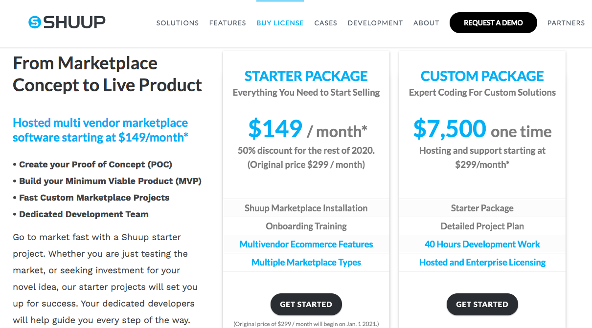

md-to-pdf README.md

# mymarketplacebuilder.com

# shuup.com

# arcadier.com

# ilance.com

# multimerch.com

# sharetribe.com

# cs-cart.com

# ixxo.com

# Magento
Magento's pricing is not readily available on their website. Graybox provies a rough estimate: 

https://graybox.co/knowledge/blog/how-much-does-magento-2-cost

# X-Cart

# Yo-Cart

# WCLovers

# WCVendors

# Kreezalid

# Purchase Commerce

